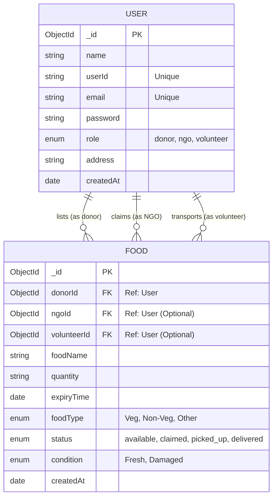

# SaveBite Database ER Diagram

This diagram illustrates the structure of the SaveBite database, focusing on the `User` and `Food` entities and the relationships between them based on roles.

## Entity Details

### User
The `User` entity handles authentication and role-based permissions.
- **Donor**: Hotels/Restaurants that list excess food.
- **NGO**: Organizations that claim food for distribution.
- **Volunteer**: Individuals who help with the logistics of moving food from Donors to NGOs.

### Food
The `Food` entity tracks the lifecycle of a food donation.
- **donorId**: Mandatory link to the user who created the listing.
- **ngoId**: Set when an NGO claims the food.
- **volunteerId**: Set when a volunteer takes responsibility for delivery.
- **status**: Tracks the progress from "available" to "delivered".
